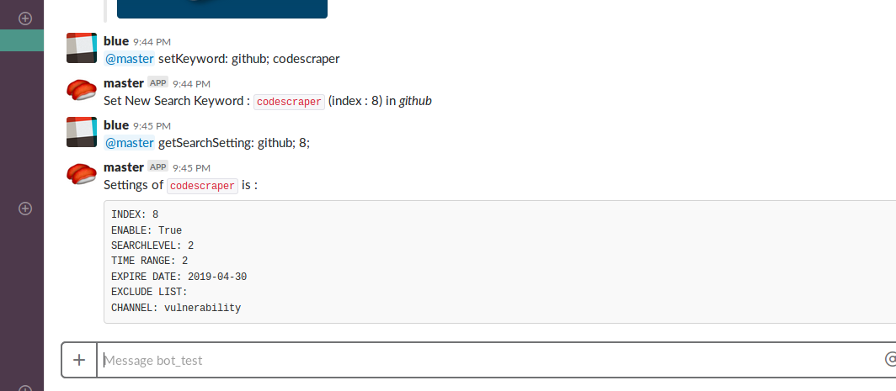

# CodeScraper

## 概要
Github, Gitlab, Pastebinなどのサイトを事前に登録したキーワードで検索し、新しいものが見つかった際に通知してくれるSlackbotです

現在以下の機能が実装されています

|名前|説明|備考|
|---|---|---|
|github|Github の新規リポジトリを検索します||
|gist|Github Gist の新規投稿を検索します||
|github_code|Github のコード検索を行います<br>精度は Github のインデックスによります|github apiが必要です|
|gitlab|Gitlab の検索を行います||
|gitlab_snippet|Gitlab Snippetsの新規投稿のスクレイピングを行います|キーワードは正規表現で登録できます|
|google_custom|Google Custom Search を用いて検索を行います|事前にサーチエンジンを作成し、そのEngine ID と API Token を設定する必要があります<br>無料版は1日100リクエストの制限があります|
|pastebin|Pastebin Scraping API を用いて Pastebin のスクレイピングを行います|利用には Pastebin PRO Account(有償)が必要です<br>キーワードは正規表現で登録できます|
|rss_feed|RSS Feedを取得します<br>通知する Feed は特定のワードでフィルタできます||
|twitter|Twitter の検索を行います|||


## Requirements
Docker を利用して、動かすことを想定しています

そうでない場合、MongoDBとPython3 及び以下のライブラリが必要です
 - slackbot (https://github.com/lins05/slackbot)
 - lxml
 - crontab
 - feedparser
 - python-dateutil
 - pymongo
 - pyquery

## インストール
Dockerを利用する場合

```sh
docker-compose build
```

Dockerを利用しない場合

```sh
pip3 install -r requirements
```

## 使い方
### CodeScrapterの起動
利用するには slackbot_settings.py が必要です
最初のこのファイルを作成してください

```sh
mv ./master/slackbot_settings.py.sample ./master/slackbot_settings.py
vim ./master/slackbot_settings.py
```

設定ファイルを編集します
- 必須項目
  - API_TOKEN (6行目)
    - Slackにログインしたうえで、 [ここ](https://my.slack.com/services/new/bot) にアクセスし、ボットを作成します
    - 作成したSlackボットのAPI Token を記載します
  - channels(17〜19行目)
    - Slackボットに通知させる Slackチャンネルを指定します
    - 上記で作成した Slackボット をここに記載するチャンネルに参加させておいてください
    - 最低でも1つ以上のチャンネルを記載しておく必要が有ります
  - Enable Targets(90〜99行目)
    - 有効化する検索ターゲットを選択してください(True|False)
    - 以下のターゲットを有効化するには別途設定が必要です
      - github_code : github_access_token の設定が必要です
      - pastebin : Pastebin PRO account(有償)と固定IPが必要です. 購入後、Pastebin に対してScraping API を利用する固定IPをホワイトリスト登録するように設定する必要があります
      - google_custom : google_custom_api_key と google_custom_search_engine_id の設定が必要になります
  - default_channel(22〜30行目)
    - 各ターゲットの検索結果を通知するチャンネルです
    - 各検索キーワードごとに変更することも可能です
    - channels に記載のない文字列が記載されている場合、channels の先頭のチャンネルが指定されます

- 任意設定
  - github_access_token(81行目)
    - github_code を有効にした場合必要です
    - [ここ](https://github.com/settings/tokens) から取得してください
  - google_custom_api_key(86行目)
    - google_custom を有効にした場合必要です
    - [ここ](https://console.developers.google.com/) から取得してください
  - google_custom_search_engine_id(87行目)
    - google_custom を有効にした場合必要です
    - [ここ](https://console.developers.google.com/) から取得してください
  - Interval(102〜113行目)
    - 各検索ターゲットの検索実行時間を設定します
    - crontab の形式で記載します
  - default_settings(33〜77行目)
    - 各検索ターゲットにキーワードを登録する際のデフォルトの設定です
    - 各項目の内容は以下の表の通りです

|項目|説明|
|---|---|
|Enable|キーワードの有効無効を設定します(True&#124;False)|
|SearchLevel|検索ターゲット github, github_code における検索範囲の設定です(1&#124;2). 2より1のほうが広い範囲を検索します|
|Time_Range|検索ターゲット github, gist における検索範囲の日数を設定します. 検索実行日から、ここに設定された日数前以降に作成されたものが検索対象となります|
|Expire_date|キーワードの有効期限を設定します. 有効期限は登録時点に日にちから、ここに設定された日数後となります. 有効期限が切れたキーワードは自動で無効化されます|
|Channel|通知するチャンネルを設定します. default_channel を設定している場合は変更は不要です|

docker-compose により起動します

```sh
docker-compose up -d
```

起動に成功すると、 Slcak に 以下のような通知が来ます
> ---CodeScraper Slackbot Started---
>
> github : SUCCESS : Started <br>
> gist : SUCCESS : Started <br>
> gitlab : SUCCESS : Started <br>

### CodeScraper コマンド
検索のキーワードは Slackボット を通じたコマンドによって操作します

はじめに、Slackボットに対して、以下のコマンドを送ると、コマンドのヘルプを表示します

```
@{Slackbotの名前} help:
```

```
Command Format is Following:
	{Command}: {target}; {arg1}; {arg2}; ...

Command List:

'setKeyword: target; [word]'	Add [word] as New Search Keyword with Default Settings.
 (abbreviation=setK:)
'removeKeyword: target; [index]'tRemove the Search Keyword indicated by [index].
 (abbreviation=removeK:)
'enableKeyword: target; [index]'	Enable the Search Keyword indicated by [index].
 (abbreviation=enableK:)
'disableKeyword: target; [index]'	Disable the Search Keyword indicated by [index].
 (abbreviation=disableK:)
'setSearchLevel: target; [index]'	Set Search Level of Github Search (1:easily 2:) indicated by [index]. It is used in github and github_code.
 (abbreviation=setSL:)
'setExpireDate: target; [index]; [expiration date]'	Set a Expiration Date of the Keyword indicated by [index]. [expiration date] Format is YYYY-mm-dd.
 (abbreviation=setED:)
'setChannel: target; [index];[channel]'	Set channel to notify the Search Keyword's result.
 (abbreviation=setC:)
'getKeyword: target;'	Listing Enabled Search Keywords.
 (abbreviation=getK:)
'getAllKeyword: target;'	Listing All Search Keyword (include Disabled Keywords).
 (abbreviation=getAllK:)
'getSearchSetting: target; [index]'	Show Setting of the Search Keyword indicated by [index].
 (abbreviation=getSS:)

'reMatchTest: target; [index]; [text]'	Check wheaer the pattern indicated by [index] in [target] matches [text]. If set pattern to Pastebin ID, check the contens of pastebin.
'setFeed: [name]; [url]'	Add RSS Feed to [url] as [name].
 (abbreviation=setF:)
'setFeedFilter: [name]; [filter]'	Add new RSS Feed Filter. Notily only contains filter words.
 (abbreviation=setFF:)
'editFeedFilter: [name]; [index]; filter'	Edit Feed Filter indicated by [index] in RSS Feed of [name].
 (abbreviation=editFF:)
'removeFeedFilter: [name]; [index];'	Remove Feed Filter indicated by [index] in RSS Feed of [name].
 (abbreviation=removeFF:)
'setTwitterQuery: [query]; ([users];)'	Set [query] with Default Settings. If set [users], notify only from these users.
 (abbreviation=setTQ:)
'editTwitterQuery: [index]; [query]; ([users];)'	Edit Twitter Query indicated by [index].
 (abbreviation=editTQ:)
'addUserTwitterQuery: [index]; [users];'	Add User to Twitter Query indicated by [index]. That query notify only from these users.
 (abbreviation=addUserTQ:)
'removeTwitterQuery: [index];'	Remove Twitter Query indicated by [index].
 (abbreviation=removeTQ:)

'help:'	Show this Message.

Target:
	github
	gist
	github_code
	gitlab
	gitlab_snippet (Use RE match)
	google_custom
	pastebin (Use RE match)
	rss_feed
	twitter
```

Slackボットに対してコマンドを送ることで、キーワードを登録していきます

コマンドの以下の通りです.
具体的な利用方法は help: コマンドを参照してください

|コマンド名|説明|有効な検索ターゲット|
|---|---|---|
|setKeyword:|新しいキーワードを登録します|github, gist, github_code, gitlab, gitlab_snippet, google_custom, pastebin|
|removeKeyword:|指定したキーワードを削除します|github, gist, github_code, gitlab, gitlab_snippet, google_custom, pastebin, twitter|
|enableKeyword:|指定したキーワードを有効化します|すべて|
|disableKeyword:|指定したキーワードを無効化します|すべて|
|setSearchLevel:|指定したキーワードの検索範囲を設定します|github, github_code|
|setExpireDate:|指定したキーワードの有効期限を設定します|github, gist, github_code, gitlab, gitlab_snippet, google_custom, pastebin|
|setChannel:|指定したキーワードを通知するSlackチャンネルを指定します|すべて|
|getKeyword:|設定されている検索キーワードのうち有効化されているものの一覧を表示します|すべて|
|getAllKeyword:|設定されている検索キーワードの一覧を表示します|すべて|
|getSearchSetting:|指定したキーワードの現在の設定を表示します|すべて|
|setFeed:|rss_feed に新たな Feed を登録します|-|
|setFeedFilter:|Feed の通知フィルタを設定します|-|
|editFeedFilter:|Feed の通知フィルタを編集します|-|
|removeFeedFilter:|Feed の通知フィルタを削除します|-|
|setTwitterQuery:|twitter に新たな検索クエリを登録します|-|
|editTwitterQuery:|twitter 検索クエリを編集します|-|
|addUserTwitterQuery:|twitter 検索クエリにユーザ条件を追加します|-|
|removeTwitterQuery:|twitter 検索クエリを削除します|-|
|help:|ヘルプを表示します|-|

登録されたキーワードには Index が振られます。設定の変更には Index を指定します。
各キーワードの Index はキーワードの登録時、もしくは getKeyword: コマンドによって知ることができます。



Github 新しいリポジトリを見つけた際の通知


### 注意点
- Pastebin
  - Pastebin PRO Account（有償）が必要です
  - 購入後、[このページ](https://pastebin.com/doc_scraping_api) にて、CodeScraperを動かすホストのIPをホワイトリスト登録してください
  - ホワイトリスト登録が必要なため、固定IPが必要です
- Pastebin, Gitlab Snippet
  - 記号を含むキーワードは正規表現として検索します(例:`[a-z1-7]{16}\.onion`, `example.com`). これらは大文字小文字を区別します
  - 記号を含まないキーワードは大文字小文字を区別せずに、キーワードマッチを行います
  - 長い正規表現や処理に時間がかかるパターンはCPUに負荷をかける可能性があるため、控えましょう
- Google Custom Search
  - 無料アカウントで利用できるリクエスト数には制限があり、1日100リクエストまでとなっています
  - 2時間おきに検索を行う設定とした場合、1日に12回検索を行います. 登録キーワードが9個を超えると、　12 * 9 = 108 となり、制限回数を超過します. 検索の頻度によって登録できるキーワードの数に制限があることを認識してください

## Author
[blueblue](https://twitter.com/piedpiper1616)
